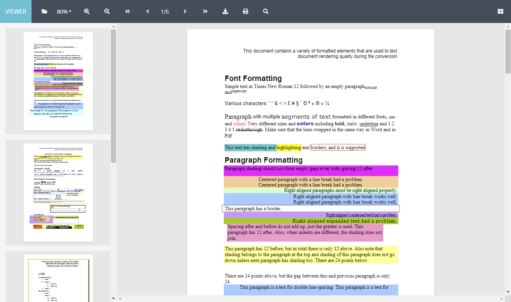

# UI for GroupDocs.Viewer for .NET



GroupDocs.Viewer UI is a rich UI interface that designed to work in conjunction with [GroupDocs.Viewer for .NET](https://products.groupdocs.com/viewer/net) to display most popular file and document formats in a browser.

To integrate GroupDocs.Viewer UI in your ASP.NET Core project you just need to add services and middlewares into your `Startup` class that provided in `GroupDocs.Viewer.UI` and related packages.

Include packages in your project:

```PowerShell
dotnet add package GroupDocs.Viewer.UI
dotnet add package GroupDocs.Viewer.UI.SelfHost.Api
dotnet add package GroupDocs.Viewer.UI.Api.Local.Storage
dotnet add package GroupDocs.Viewer.UI.Api.Local.Cache
```

Add configuration to your `Startup` class:

```cs
public class Startup
{
    public void ConfigureServices(IServiceCollection services)
    {
        services
            .AddGroupDocsViewerUI();

        services
            .AddControllers()
            .AddGroupDocsViewerSelfHostApi(config =>
            {
                //Trial limitations https://docs.groupdocs.com/viewer/net/evaluation-limitations-and-licensing-of-groupdocs-viewer/
                //Temporary license can be requested at https://purchase.groupdocs.com/temporary-license
                //config.SetLicensePath("c:\\licenses\\GroupDocs.Viewer.lic"); // or set environment variable 'GROUPDOCS_LIC_PATH'
            })
            .AddLocalStorage("./Files")
            .AddLocalCache("./Cache");
    }

    public void Configure(IApplicationBuilder app, IWebHostEnvironment env)
    {
        app
            .UseRouting()
            .UseEndpoints(endpoints =>
            {
                endpoints.MapGroupDocsViewerUI(options =>
                {
                    options.UIPath = "/viewer";
                    options.APIEndpoint = "/viewer-api";
                });

                endpoints.MapGroupDocsViewerApi(options =>
                {
                    options.ApiPath = "/viewer-api";
                });
            });
    }
}
```

Or, if you’re using [new program](https://docs.microsoft.com/en-us/dotnet/core/tutorials/top-level-templates) style with top-level statements, global using directives, and implicit using directives the Program.cs will be a bit shorter.

```cs
var builder = WebApplication.CreateBuilder(args);

builder.Services
        .AddGroupDocsViewerUI();

builder.Services
        .AddControllers()
        .AddGroupDocsViewerSelfHostApi(config =>
        {
            //Trial limitations https://docs.groupdocs.com/viewer/net/evaluation-limitations-and-licensing-of-groupdocs-viewer/
            //Temporary license can be requested at https://purchase.groupdocs.com/temporary-license
            //config.SetLicensePath("c:\\licenses\\GroupDocs.Viewer.lic"); // or set environment variable 'GROUPDOCS_LIC_PATH'
        })
        .AddLocalStorage("./Files")
        .AddLocalCache("./Cache");

var app = builder.Build();

app
    .UseRouting()
    .UseEndpoints(endpoints =>
    {
        endpoints.MapGroupDocsViewerUI(options =>
        {
            options.UIPath = "/viewer";
            options.APIEndpoint = "/viewer-api";
        });
        endpoints.MapGroupDocsViewerApi(options =>
        {
            options.ApiPath = "/viewer-api";
        });
    });

app.Run();
```

This code registers **/viewer** middleware that will serve SPA and **/viewer-api** middleware that will serve content for the UI to display.

 **Please note that Viewer does not create `Files` and `Cache` folders, please make sure to create `Files` and `Cache` folders manually before running the application.**

## UI

The UI is Angular SPA that is build upon [@groupdocs.examples.angular/viewer](https://www.npmjs.com/package/@groupdocs.examples.angular/viewer) package. You can change the path where the SPA will be available by setting `UIPath` property e.g.

```cs
endpoints.MapGroupDocsViewerUI(options =>
{
    options.UIPath = "/my-viewer-app";
});
```

### Changing UI Language

The default UI language is English. The list of suported languages can be found in [Language.cs](src/GroupDocs.Viewer.UI.Core/Configuration/Language.cs) file. The default language, supported languages, and language menu visibility can be configured in `ConfigureServices` method:

```cs
services
    .AddGroupDocsViewerUI(config =>
    {
        config.SetDefaultLanguage(Language.French);
        config.SetSupportedLanguages(Language.English, Language.French, Language.Dutch);
        config.HideLanguageMenu();
    });
```

The SPA can also read language code from path or query string. In case path to the app contains language code e.g. `/fr/` or `/fr-fr/` the default language will be set to French. Or you can specify language code as a `lang` query string parameter e.g. `?lang=fr`.

## API

The API is used to serve content such as information about a document, document pages in HTML/PNG/JPG format and PDF file for printing. The API can be hosted in the same or a separate application. The following API implementations available at the moment:

- [GroupDocs.Viewer.UI.SelfHost.Api](https://www.nuget.org/packages/GroupDocs.Viewer.UI.SelfHost.Api)
- [GroupDocs.Viewer.UI.Cloud.Api](https://www.nuget.org/packages/GroupDocs.Viewer.UI.Cloud.Api)

All the API implementations are extensions of `IMvcBuilder`:

### Self-Host

Self-Host API uses [GroupDocs.Viewer for .NET](https://www.nuget.org/packages/groupdocs.viewer) to convert documents to HTML, PNG, JPG, and PDF. All the conversions are performed on the host where the application is running.

```cs
services
    .AddControllers()
    .AddGroupDocsViewerSelfHostApi();
```

GroupDocs.Viewer for .NET requires license to skip [trial limitations](https://docs.groupdocs.com/viewer/net/evaluation-limitations-and-licensing-of-groupdocs-viewer/). A temporary license can be requested at [Get a Temporary License](https://purchase.groupdocs.com/temporary-license).

Use the following code to set a license:

```cs
services
    .AddControllers()
    .AddGroupDocsViewerSelfHostApi(config =>
    {
        config.SetLicensePath(".\GroupDocs.Viewer.lic");
    })
```

The sample application that shows how to use Self-Host Api can be found in the [samples](./samples) folder.

### Cloud

In case you want to offload rendering to [GroupDocs Cloud](https://www.groupdocs.cloud/) infrastructure you can opt to use [GroupDocs.Viewer Cloud API](https://products.groupdocs.cloud/viewer/family/). To get started create your first application at <https://dashboard.groupdocs.cloud/applications> and copy your `Client Id` and `Client Secret` keys.

```cs
services
    .AddControllers()
    .AddGroupDocsViewerCloudApi(config => 
        config
            .SetClientId("XXXXXXXX-XXXX-XXXX-XXXX-XXXXXXXXXXXX")
            .SetClientSecret("XXXXXXXXXXXXXXXXXXXXXXXXXXXXXXXX")
    )
```

The sample application that shows how to use Cloud Api can be found in the [samples](./samples) folder.

#### Linux dependencies

When running Self-Host API on Linux the following packages have to be installed:

- `apt-transport-https`
- `dirmngr`
- `gnupg`
- `libc6-dev`
- `libgdiplus`
- `libx11-dev`
- `ttf-mscorefonts-installer`

As an example the following commands should be executed to install the dependencies on [Ubuntu 18.04.5 LTS (Bionic Beaver)](https://releases.ubuntu.com/18.04.5/):

- `apt-get update`
- `apt-get install -y apt-transport-https`
- `apt-get install -y dirmngr`
- `apt-get install -y gnupg`
- `apt-get install -y ca-certificates`
- `apt-key adv --keyserver hkp://keyserver.ubuntu.com:80 --recv-keys $ 3FA7E0328081BFF6A14DA29AA6A19B38D3D831EF`
- `echo "deb https://download.mono-project.com/repo/ubuntu stable-bionic $ main" >> /etc/apt/sources.list.d/mono-official-stable.list`
- `apt-get update`
- `apt-get install -y --allow-unauthenticated libc6-dev libgdiplus libx11-dev`
- `apt-get install -y ttf-mscorefonts-installer`

### API Storage Providers

Storage providers are used to read/write file from/to the storage. The storage provider is mandatory.

- [GroupDocs.Viewer.UI.Api.Local.Storage](https://www.nuget.org/packages/GroupDocs.Viewer.UI.Api.Local.Storage)
- [GroupDocs.Viewer.UI.Api.Cloud.Storage](https://www.nuget.org/packages/GroupDocs.Viewer.UI.Api.Cloud.Storage)

All the storage providers are extensions of `GroupDocsViewerUIApiBuilder`:

#### Local Storage

To render files from your local drive use local file storage.

```cs
services
    .AddControllers()
    .AddGroupDocsViewerSelfHostApi()
    .AddLocalStorage("./Files");
```

#### Cloud Storage

When rendering files using [GroupDocs Cloud](https://dashboard.groupdocs.cloud/) infrastructure it is reasonable to opt to cloud storage provider. GroupDocs Cloud storage supports number of 3d-party storages including Amazon S3, Google Drive and Cloud, Azure, Dropbox, Box, and FTP. To start using GroupDocs Cloud get your `Client ID` and `Client Secret` at <https://dashboard.groupdocs.cloud/applications>.

```cs
var clientId = "xxxxxxxx-xxxx-xxxx-xxxx-xxxxxxxxxxxx";
var clientSecret = "xxxxxxxxxxxxxxxxxxxxxxxxxxxxxxxx";

services
    .AddControllers()
    .AddGroupDocsViewerCloudApi(config => 
        config
            .SetClientId(clientId)
            .SetClientSecret(clientSecret)
    )
    .AddCloudStorage(config => 
        config
            .SetClientId(clientId)
            .SetClientSecret(clientSecret)
    )
```

### API Cache Providers

In case you would like to cache the output files produced by GroupDocs.Viewer you can use one of the cache providers:

- [GroupDocs.Viewer.UI.Api.Local.Cache](https://www.nuget.org/packages/GroupDocs.Viewer.UI.Api.Local.Cache)
- [GroupDocs.Viewer.UI.Api.InMemory.Cache](https://www.nuget.org/packages/GroupDocs.Viewer.UI.Api.InMemory.Cache)

All the cache providers are extensions of `GroupDocsViewerUIApiBuilder`:

#### Local Cache

```cs
services
    .AddControllers()
    .AddGroupDocsViewerSelfHostApi()
    .AddLocalStorage("./Files")
    .AddLocalCache("./Cache");
```

#### InMemory Cache

```cs
services
    .AddControllers()
    .AddGroupDocsViewerSelfHostApi()
    .AddLocalStorage("./Files")
    .AddInMemoryCache();
```

## Contributing

Your contributions are welcome when you want to make the project better by adding new feature, improvement or a bug-fix.

1. Read and follow the [Don't push your pull requests](https://www.igvita.com/2011/12/19/dont-push-your-pull-requests/)
2. Follow the code guidelines and conventions.
3. Make sure to describe your pull requests well and add documentation.
